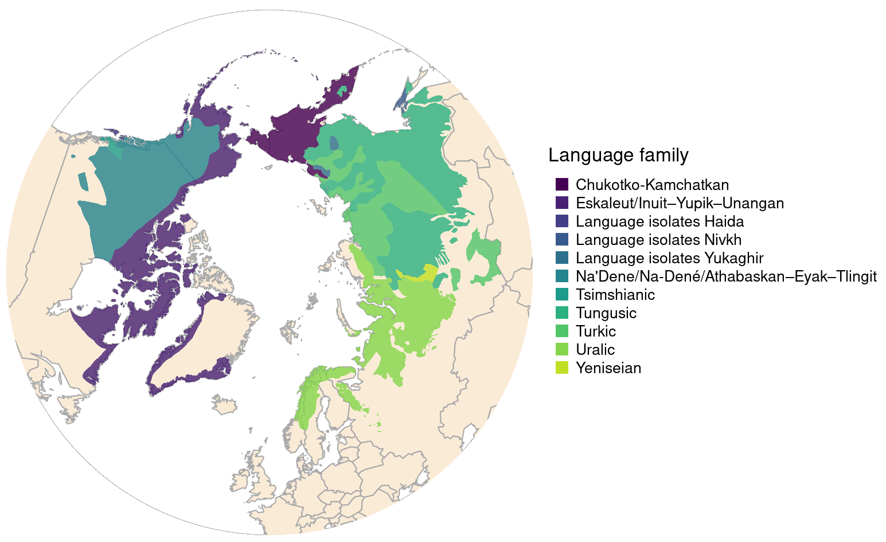

>   It's been over three years since a blog post.  Does that even count as a blog?  Since the last one, I've become a professor.  Which (a) takes a big old chunk out of time to do anything else, but (b) provides access to a hitherto unknown resource known as [graduate students](https://eligurarie.github.io/_pages/labmembers/) (a subset of the greater [lab members](https://eligurarie.github.io/_pages/labmembers/) phenomenon).  One of these **Chloe Beaupré**, provides the follwoing hot tips for dealing with some very mapping issues. 
{: style="font-size: 80%"}

For a presentation I wanted to create a plot of the Arctic, showing the circumpolar distribution of *Rangifer* populations next to a map of a map of Arctic Indigenous languages. Turns out mapping a circumpolar projection in R is not as easy a making a pretty map of a smaller area at lower latitudes. Here is an outline to recreate (one of) these plots.


```r
packages <- list("dplyr","sf", "ggplot2","mapview",
                 "viridis","maptools", "raster")
sapply(packages, require, character = TRUE)
```

We'll plot the map of arctic Indigenous Peoples languages and dialects since the data are made publicly available by the [Arctic Indigenous languages and revitalization project](https://arctic-indigenous-languages-uito.hub.arcgis.com/). Shapefiles can be downloaded [here](https://arctic-indigenous-languages-uito.hub.arcgis.com/datasets/UITO::arctic-indigenous-peoples-languages-and-revitalization-languages-and-dialects/explore).

After downloading the shapefiles, read them into your environment and re-project to the EPSG 3995 projection (arctic polar stereographic) using the `sf` package


```r
lang <- st_read("data/Arctic_Indigenous_Peoples_languages_and_revitalization_-_Languages_and_Dialects.shp") %>%
  st_transform(st_crs(3995))
```

```
## Reading layer `Arctic_Indigenous_Peoples_languages_and_revitalization_-_Languages_and_Dialects' from data source `/home/elie/teaching/MiscellaneousLectures/lectures/ArcticProjections/data/Arctic_Indigenous_Peoples_languages_and_revitalization_-_Languages_and_Dialects.shp' 
##   using driver `ESRI Shapefile'
## Simple feature collection with 167 features and 17 fields (with 1 geometry empty)
## Geometry type: MULTIPOLYGON
## Dimension:     XY
## Bounding box:  xmin: -180 ymin: 47.54787 xmax: 180 ymax: 81.26326
## Geodetic CRS:  WGS 84
```

We usually love plotting spatial data using the `mapview` package because it's fast and interactive but it defaults to the dreaded Mercator projection.


```r
mapview(lang)
```


*[ed. note - interactivity of mapview disabled on blog]*

Looks horrifying.


There is an argument in mapview to use the native CRS (which we've transformed to Arctic Polar Stereographic EPSG 3995), let's try it out.

```r
mapview(lang, native.crs = TRUE, map.types="Esri.WorldImagery")
```


This looks better! But there isn't a basemap for the North Pole so we have our language polygons floating in the ether. We can do better.

The `maptools` package provides a simple whole-world coastline data set. We set the y-limit to 45 degrees North, so only keep the coastlines in the north.


```r
data("wrld_simpl", package = "maptools")                                                                            
w <- raster::crop(wrld_simpl, extent(-180, 180, 45, 90))                                                                   
plot(w)    
```


After downloading the northern coastlines, convert to a simple feature multipolygon, then re-project to the arctic polar stereographic (EPSG 3995).


```r
# make it into an sf object, transform the crs
w_sf <- w %>%
  st_as_sf(coords = c("long", "lat"), crs = 4326) %>%
  st_transform(st_crs(3995))
```

The following code uses `ggplot2` to plot the arctic coastlines and overlays the arctic Indigenous Peoples languages shapefile.


```r
ggplot() + 
  geom_sf(data=w_sf, fill = "grey", colour = "black", alpha = 0.5) +
  geom_sf(data = lang[!is.na(lang$LangFamily),], aes(fill = LangFamily), alpha = 0.8) +
  scale_fill_viridis_d()+
  scale_x_continuous(breaks = NULL) +
  labs(title = "", x = "", y = "", fill = "Language family") +
  theme(axis.text = element_blank(),
        axis.ticks = element_blank(),
        panel.background = element_blank(), 
        text = element_text(size = 12),
        legend.key.size = unit(.2, 'cm')) # make the legend smaller
```


The remaining code creates a similar plot using base R if that's more your style (*cough* owner-of-this-blog-Elie *cough*).


```r
cols <- viridis(n = length(unique(lang$LangFamily)))
labs <- levels(as.factor(lang$LangFamily))

# set margins
par(mar = rep(.1,4))
layout(matrix(1:2, ncol =2), widths = c(1.5,1)) 

# plot the coastlines, to initiate the area
plot(st_geometry(w_sf), lwd=1, lty=1, col= alpha("grey", .5), border = "darkgrey")

# plot the language data
plot(lang["LangFamily"], lwd = 1, lty = 1, pal = alpha(cols, .8), add = TRUE, border = NA)

par(mar = c(0,0,6,0), xpd = NA); plot.new()
mtext(side = 3, "Language family", font = 1, line = 0, adj = 0)
legend(x = "topleft", ncol = 1, cex = 0.8, legend = labs, col = cols, pch=15, pt.cex = 1.5, bty = "n")
```


- Chloe Beaupré

## Editorial (*cough-cough*) comment

Maybe you're bothered by the weirdly straight polygon line in Chloe's otherwise lovely map?  Try this:


```r
data("wrld_simpl", package = "maptools")                                                                            
w.equator <- raster::crop(wrld_simpl, extent(-180, 180, 0, 90))  %>%
  st_as_sf(coords = c("long", "lat"), crs = 4326) %>%
  st_transform(st_crs(3995))                                                               

donut <- list(cbind(x = c(0:360, 360:0, 0), y = c(rep(45, 361), c(rep(0,361)), 45))) %>% st_polygon %>%  
    st_sfc(crs = 4326) %>% st_transform(st_crs(3995)) 

fortyfive <- cbind(x = 0:360, y = rep(45, 361)) %>% st_linestring() %>%  
    st_sfc(crs = 4326) %>% st_transform(st_crs(3995)) 
```

Now ... put it all together


```r
par(mar = rep(.1,4))
layout(matrix(1:2, ncol =2), widths = c(1.5,1)) 

plot(fortyfive, col = "darkgrey")
plot(st_geometry(w.equator), col = "antiquewhite", add = TRUE, border = "darkgrey")
plot(donut, add = TRUE, col = "white", border = NA)
plot(lang["LangFamily"], lwd = 1, lty = 1, pal = alpha(cols, .8), add = TRUE, border = NA)

par(mar = c(0,0,6,0), xpd = NA); plot.new()
mtext(side = 3, "Language family", font = 1, line = 0, adj = 0)
legend(x = "topleft", ncol = 1, cex = 0.8, legend = labs, col = cols, pch=15, pt.cex = 1.5, bty = "n")
```



Do *that* in ggplot!


